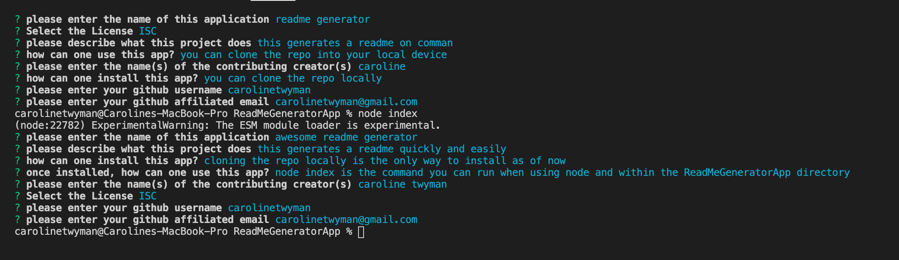

  
# ReadMe Generator

## Table of Contents
* [Description](#description)
* [Installation](#installation)
* [Usage](#usage)
* [License](#license)
* [Contributors](#contributors)
* [Questions](#questions)

## Description
This generates ReadMes quickly and easily

## Installation Instructions
Clone the repo to one's local device

## Usage Information
For a walkthrough, please visit[my YouTube] (https://www.youtube.com/watch?v=rYNCqZ1MwD4&t=1s&ab_channel=Caroline)
To use the app, enter the ReadMeGeneratorApp Directory and type the command "node index" or "node index.js."

## License
ISC

## Contributors
Caroline Twyman

## Questions
Contact me:

Github: [https://github.com/carolinetwyman](https://github.com/carolinetwyman)
Email: [carolinetwyman@gmail.com](carolinetwyman@gmail.com)
